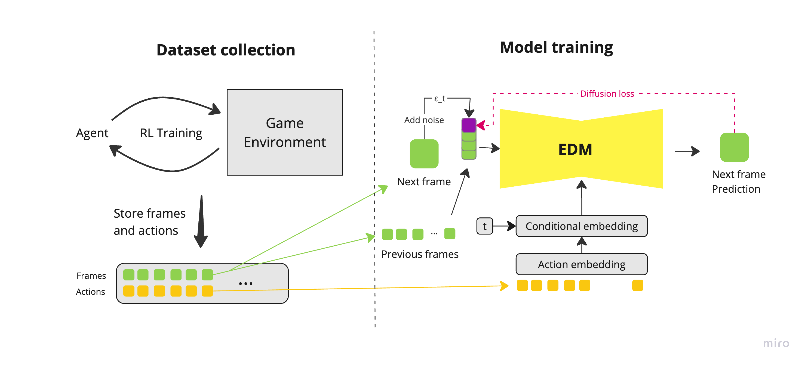

# Snake Diffusion model

It is an educational repo to build realtime snake game based on Diffusion model. It was inspired by great papers:
* Doom Diffusion from Google ([paper](https://arxiv.org/html/2408.14837v1))
* Oasis ([github](https://github.com/etched-ai/open-oasis))
* Diamond ([paper](https://arxiv.org/pdf/2405.12399))

My goal was to build something similar and I have choosen Snake game for simple logic. It took near 2 months of different experiments to get a ready-to-play model.

If you don't have GPU you can use [runpod.io](runpod.io)(it is paid). Also I created a [Google colab](https://colab.research.google.com/drive/1OxneGBeb4B1U5dszVf_2UDYZLHshJQ5T?usp=sharing) for playing.

## Model scheme 

After couple of experiments I chose EDM diffusion model, because it shows high performance on small sample steps. DDIM requires much more steps to generate the same quality.



## Install requirements

```shell
pip install -r requirements.txt
```

## Training

To train a new model, you should have a dataset. You can download it running a script:
```shell
bash scripts/download-dataset.sh
```

Or generate manually:

```shell
python src/generate_dataset.py --model agent.pth --dataset training_data --record
```

Then you can start training with command:
```shell
python src/train.py --model-type edm --output models --loader loader.pkl --gen-val-images --config Diffusion.yaml
```

I trained my model on [runpod.io](runpod.io). It had 32 epochs, took ~27 hours and the cost was 10$.

## Inference

You can download my ready-to-use model:
```shell
git clone https://huggingface.co/juramoshkov/snake-diffusion models
```
Then run [Play.ipynb](src/play.ipynb), where you can play Snake with 1 fps 🤓.

Another way to play is to use [Google colab](https://colab.research.google.com/drive/1OxneGBeb4B1U5dszVf_2UDYZLHshJQ5T?usp=sharing)
